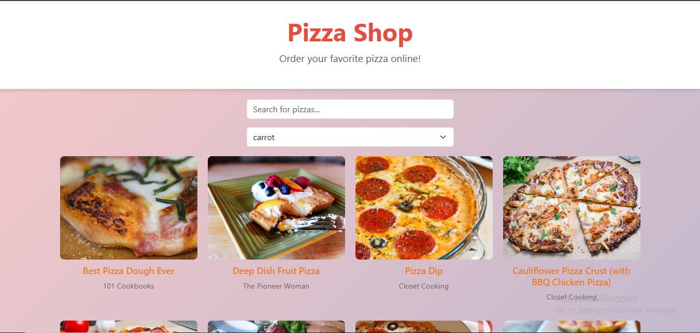

# Pizza Shop

This is a simple, responsive web application for browsing and searching pizza recipes using the [Forkify API](https://forkify-api.herokuapp.com/). Users can search for their favorite food items or select from a list of ingredients to explore related recipes.

 

## Features

- Search recipes dynamically using a text input
- Select from a dropdown list of common ingredients
- Fetch recipes from an external API (Forkify)
- Responsive layout using Bootstrap 5
- Hover animation effects for cards
- Clean and colorful UI

 

## File Structure

day15p/ 
├── README.md 
├── index.html 
├── images/ 
│&nbsp;&nbsp;&nbsp;&nbsp;└── sample.png 
├── css/ 
│&nbsp;&nbsp;&nbsp;&nbsp;└── style.css 
│&nbsp;&nbsp;&nbsp;&nbsp;└── bootstrap.min.css 
└── js/ 
&nbsp;&nbsp;&nbsp;&nbsp;└── script.js 
&nbsp;&nbsp;&nbsp;&nbsp;└── bootstrap.bundle.min.js

 

## Technologies Used

- HTML5
- CSS3 (with Bootstrap 5)
- JavaScript (ES6)
- Forkify Recipe API

 

## Screenshot

 

## Getting Started

1. Clone or download this repository.
2. Make sure all files are in the correct structure as shown above.
3. Open `index.html` in a web browser.
4. Start typing or selecting from the dropdown to browse recipes!

 

## License

This project is open source and free to use for educational purposes.

---

